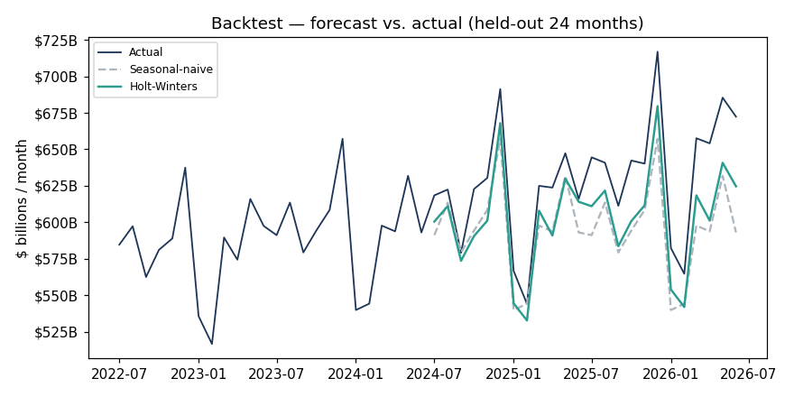
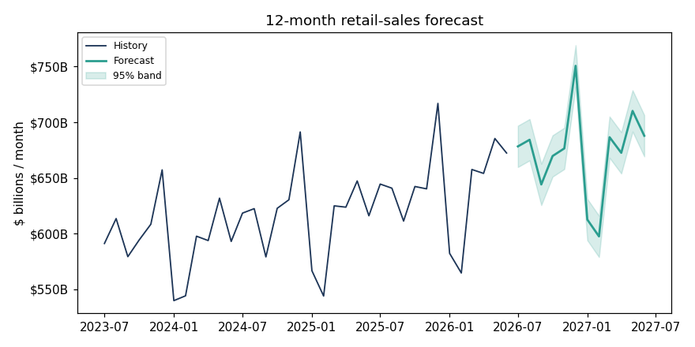
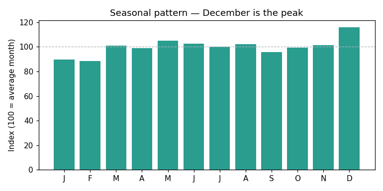

# US Retail Sales Forecasting

Forecasting monthly US retail & food-services sales with time-series methods,
so a business could plan inventory, staffing, and cash flow *ahead* of demand.

> ⏳ **Work in progress** — being built out over several days. Done so far: the
> forecasting engine and an **interactive dashboard**. Coming next: a second
> model (SARIMA), unit tests, a notebook, and a written write-up.

## Problem

Retail demand is highly seasonal and trend-driven. Guessing next quarter's sales
leads to over- or under-stocking. This project builds a model that learns the
trend and the yearly seasonal shape from 30+ years of history and projects the
next 12 months, with an honest accuracy measurement.

## Dataset

[FRED — Advance Retail Sales: Retail and Food Services (RSXFSN)](https://fred.stlouisfed.org/series/RSXFSN),
monthly, **not** seasonally adjusted (so the seasonality is visible and worth
modelling). **414 months, 1992–2026.**

## Approach

1. **Explore** — plot the long-run trend and decompose the series into trend,
   seasonal, and residual components.
2. **Backtest** — hold out the last 24 months and compare two models:
   - a **seasonal-naive baseline** (this month = same month last year), and
   - **Holt-Winters exponential smoothing** (additive trend + multiplicative
     seasonality).
3. **Evaluate** — MAE, RMSE, and MAPE on the held-out window.
4. **Forecast** — refit on all data and project the next 12 months with a band.

## Results so far

Backtest on the held-out last 24 months:

| Model | MAE ($M) | RMSE ($M) | MAPE |
|-------|:--------:|:---------:|:----:|
| Seasonal-naive baseline | 33,829 | 39,007 | 5.26% |
| **Holt-Winters smoothing** | **26,911** | **29,823** | **4.22%** |

Holt-Winters is the clear winner — it tracks both the rising trend and the
holiday seasonality that the naive baseline misses.





**Seasonal insight:** December runs ~116% of an average month (holiday shopping);
February is the low point at ~88%.

## Interactive dashboard

[`dashboard.html`](dashboard.html) is a self-contained interactive dashboard —
KPI tiles, a hover-able history-and-forecast chart with a confidence band, the
seasonal pattern, and a forecast table. It has no dependencies: open the file in
any browser. The forecast data is generated by the analysis script and embedded
into the page.

## Run it

```bash
pip install -r requirements.txt
python forecasting_analysis.py
```

Metrics print to the console; charts are saved to `images/`, and the forecast is
written to `forecast.csv`.

## Tech

Python · pandas · statsmodels · scikit-learn · matplotlib

---

*Author: Muhammad Nasiruddin*
