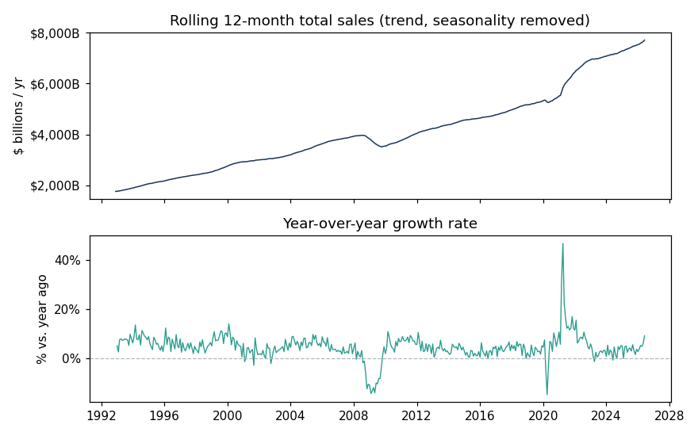

# US Retail Sales Forecasting

Forecasting monthly US retail & food-services sales with time-series methods,
so a business could plan inventory, staffing, and cash flow *ahead* of demand.

> ⏳ **Work in progress** — being built out over several days. Done so far: the
> forecasting engine (three models compared), a year-over-year growth analysis,
> and an **interactive Streamlit dashboard**. Coming next: unit tests, a
> notebook, and a written write-up.

## Problem

Retail demand is highly seasonal and trend-driven. Guessing next quarter's sales
leads to over- or under-stocking. This project builds a model that learns the
trend and the yearly seasonal shape from 30+ years of history and projects the
next 12 months, with an honest accuracy measurement.

## Dataset

[FRED — Advance Retail Sales: Retail and Food Services (RSXFSN)](https://fred.stlouisfed.org/series/RSXFSN),
monthly, **not** seasonally adjusted (so the seasonality is visible and worth
modelling). **414 months, 1992–2026.**

## Approach

1. **Explore** — plot the long-run trend and decompose the series into trend,
   seasonal, and residual components.
2. **Backtest** — hold out the last 24 months and compare three models:
   - a **seasonal-naive baseline** (this month = same month last year),
   - **Holt-Winters exponential smoothing** (additive trend + multiplicative
     seasonality), and
   - **SARIMA** (1,1,1)(1,1,1)₁₂ — a statistical model with seasonal terms.
3. **Evaluate** — MAE, RMSE, and MAPE on the held-out window.
4. **Forecast** — refit the winning model on all data and project the next 12
   months, using SARIMA's built-in 95% confidence interval.

## Results so far

Backtest on the held-out last 24 months:

| Model | MAE ($M) | RMSE ($M) | MAPE |
|-------|:--------:|:---------:|:----:|
| Seasonal-naive baseline | 33,829 | 39,007 | 5.26% |
| Holt-Winters smoothing | 26,911 | 29,823 | 4.22% |
| **SARIMA** | **17,514** | **20,857** | **2.71%** |

**SARIMA is the clear winner** — it halves the baseline's error and beats
Holt-Winters on every measure, so it's used for the final forecast.


**Seasonal insight:** December runs ~116% of an average month (holiday shopping);
February is the low point at ~88%.

**Momentum:** stripping out seasonality, year-over-year growth has averaged
~4.4% over the last 12 months.



## Interactive dashboard

[`app.py`](app.py) is an interactive dashboard built in **Streamlit + Plotly**
(pure Python) — KPI tiles, a history-and-forecast chart with a confidence band,
the seasonal pattern, a live model-backtest table, and sliders to change the
forecast horizon and backtest window.

```bash
streamlit run app.py
```

It can also be deployed free at [share.streamlit.io](https://share.streamlit.io)
by connecting this GitHub repo.

## Run it

```bash
pip install -r requirements.txt
python forecasting_analysis.py
```

Metrics print to the console; charts are saved to `images/`, and the forecast is
written to `forecast.csv`.

## Tech

Python · pandas · statsmodels · scikit-learn · Streamlit · Plotly · matplotlib

---

*Author: Muhammad Nasiruddin*
